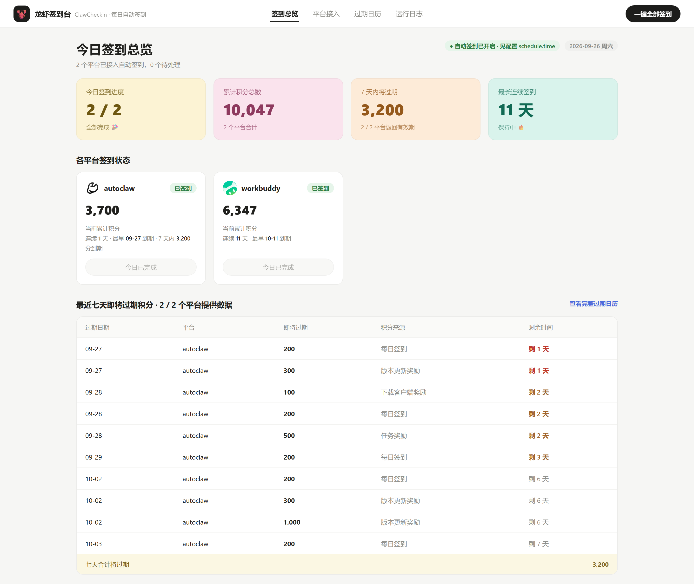
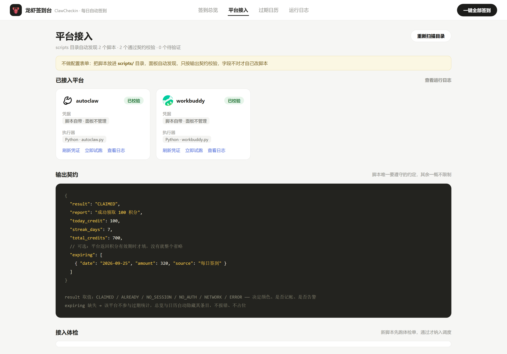
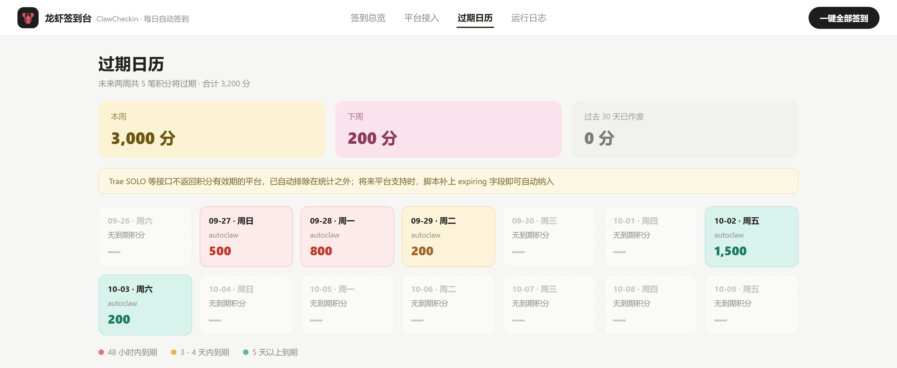
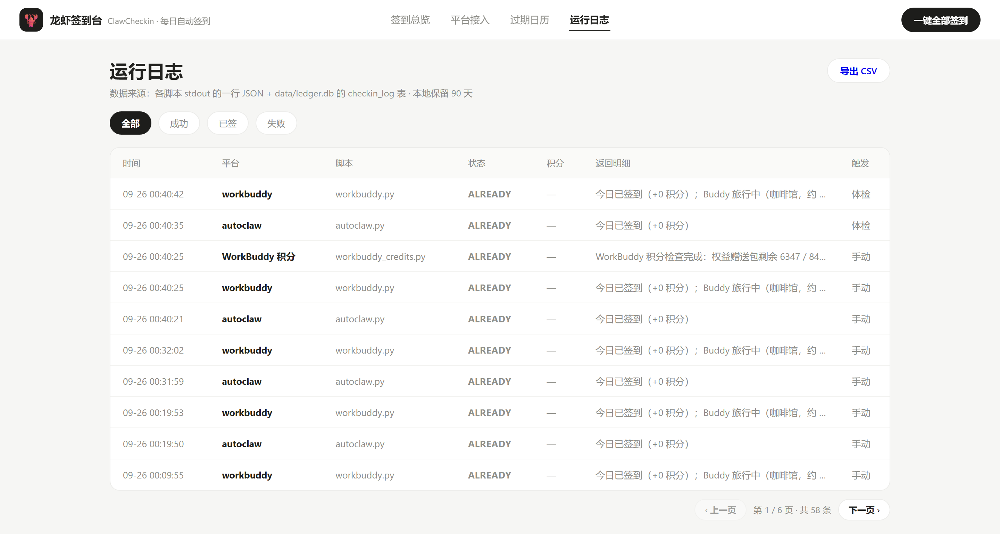

# claw-checkin：龙虾工具每日自动签到管理面板

基于 FastAPI + 原生 JS 的本地签到面板：把各龙虾工具（WorkBuddy、AutoClaw 等）的签到脚本丢进 `scripts/` 目录，自动发现、定时执行、按统一契约校验并集中展示积分与临期数据。

## 💡为什么需要？

- 每款龙虾工具的签到方式都不一样：HTTP 接口、Python 脚本、Node 脚本、CDP 浏览器操作，签到逻辑穷举不完，做配置表单永远追不上
- 签到脚本散落各处，哪天签了、哪天断了、积分快过期了，全靠记忆
- 多个平台的积分有有效期，忘签就作废，缺一个统一的「临期提醒」视角

**claw-checkin 解决这些问题**：面板不做平台适配，只做三件事——发现脚本、跑、按契约校验并展示。签到逻辑留在你自己的脚本里，面板管调度、记帐和过期提醒。

## ⭐亮点

- **每日调度**：到点自动全部签到，错过时刻（关机）开机后当日补跑一次；凭据类失败（如 AutoClaw token 尚未随客户端使用轮换）当日每小时自动补签，成功即止
- **过期日历**：未来 28 天临期积分一图看清，按紧急度配色（红 72 小时内 / 橙 3-4 天 / 青绿 5 天+），平台不返回有效期时自动隐藏、不占位
- **脚本自由**：文件名即平台名，Python / Node / Shell / Batch / PowerShell 脚本都支持，丢进 `scripts/` 即被自动发现
- **零构建前端**：原生 HTML/CSS/JS 单页，克隆即用，不装 Node、不打包；当前页写进地址栏，刷新浏览器仍停在原页面

## 📸项目预览









## 🚀快速开始

### 1. 克隆项目

```bash
# Gitee 镜像（国内访问快）
git clone https://gitee.com/yhl5244/claw-checkin.git

# GitHub 原仓库
git clone https://github.com/5244DragonLin/claw-checkin.git

cd claw-checkin
```

### 2. 安装依赖

```bash
pip install -r requirements.txt
```

### 3. 配置文件（可选）

复制 `config.example.yaml` 为 `config.yaml` 后按需修改，不复制也能直接跑（用默认值）：

```yaml
# config.yaml
server:
  port: 8317          # 面板端口
schedule:
  time: "00:05"       # 每日自动签到时刻
scripts:
  dir: scripts        # 签到脚本目录
```

### 4. 运行

```bash
# 首次体验：把示例脚本复制进 scripts/，再看效果
cp examples/mock_platform_a.py scripts/
python main.py

# 指定端口与脚本目录
python main.py --port 9000 --scripts D:/my_checkins

# 本次启动关闭定时调度（只手动触发）
python main.py --no-schedule
```

打开 `http://127.0.0.1:8317` 即可看到面板。Windows 下也可以直接双击 `start.bat` 启动。

## 🔌内置平台接入

仓库自带 WorkBuddy、AutoClaw 两个真实平台的签到脚本（`scripts/` 下），并内置了 WorkBuddy 签到内核。每个平台的接入都只需一步：

| 平台 | 你要做的事 | 脚本自动完成的 |
|------|----------|--------------|
| AutoClaw | 安装并登录一次 AutoClaw 2（之后无需再打开） | 自动解密本机加密凭据库提取 token（Windows，需 `cryptography` 包）；token 过期时用 refreshToken 调官方端点自动续期并写回，无需客户端参与；兼容旧版 OpenClaw 与手动 `auths/autoclaw.json` |
| WorkBuddy | 安装并登录 WorkBuddy 桌面端 | 自动读取本机客户端登录态凭据；新版加密凭据由本机 WorkBuddy.exe 运行时解密，无需额外配置 |

登录后回到面板点一次「签到」，卡片变绿即接入完成，之后每日自动签到。token 过期时面板显示「待验证」：WorkBuddy 重新登录客户端即可；AutoClaw 2 由脚本自动续期（无需打开客户端），仅在长期未使用导致 refreshToken 本身失效时才需要重新登录一次。

## 📜输出契约

脚本唯一要遵守的约定：**stdout 末行输出一行 JSON**。

```json
{
  "result": "CLAIMED",
  "report": "成功领取 100 积分",
  "today_credit": 100,
  "streak_days": 7,
  "total_credits": 700,
  "expiring": [ { "date": "2026-09-25", "amount": 320, "source": "每日签到" } ]
}
```

| 字段 | 必填 | 说明 |
|------|------|------|
| `result` | 是 | 六枚举之一：`CLAIMED` / `ALREADY` / `NO_SESSION` / `NO_AUTH` / `NETWORK` / `ERROR`，决定颜色、是否记帐、是否告警 |
| `report` | 建议 | 一句话返回明细，展示在日志表 |
| `today_credit` | 是 | 今日获得积分；`ALREADY` 时填 `0` |
| `streak_days` | 是 | 连续签到天数 |
| `total_credits` | 是 | 当前累计积分 |
| `expiring` | 否 | 平台返回积分有效期时才填；**缺失即该平台不参与过期统计**，相关板块自动隐藏，不报错、不占位 |

`examples/` 下有两个可直接运行的示例脚本：`mock_platform_a.py` 演示完整契约（含 `expiring`），`mock_platform_b.py` 演示无 `expiring` 时的「缺失即隐藏」。

如果某平台的积分口径跟签到接口回报的不一致，可以再写一个 `<平台>_credits` 脚本，只负责查权威余额、同样按上面的契约输出；把它加进 `scripts/_meta.json` 的 `hidden` 名单，它就不占平台卡片，会在每次签到后与面板启动时自动补跑，用来刷新卡片上的总积分。

## ⌨️CLI 模式

```bash
python main.py [选项]
```

### 服务选项

| 参数 | 说明 | 默认值 |
|------|------|--------|
| `--config` | 配置文件路径，不传自动读取同目录 `config.yaml` | 自动 |
| `--host` | 监听地址 | `127.0.0.1` |
| `--port` | 监听端口 | `8317` |

### 调度选项

| 参数 | 说明 | 默认值 |
|------|------|--------|
| `--scripts` | 签到脚本目录 | `scripts` |
| `--no-schedule` | 关闭每日定时调度 | 关闭 |
| `--run-once` | 纯签到模式：跑完所有平台与积分源后退出（配合任务计划使用） | 关闭 |

### 纯签到模式（任务计划）

不想开着面板签到时，用 `python main.py --run-once` 跑完即退（`checkin.bat` 是它的包装）：双击 `checkin.bat` 会实时显示各平台签到结果，结束后按任意键关闭窗口；注册任务计划请加 `/task` 参数静默执行：

```bat
schtasks /Create /TN "ClawCheckin" /SC DAILY /ST 00:05 /TR "D:\path\to\claw-checkin\checkin.bat /task"
```

- 运行结果照常写入 `data/ledger.db`，面板打开后完整可见；`/task` 模式下控制台日志追加在 `data/checkin.log`（超 5MB 轮转为 `.old`）
- 使用任务计划时建议在 `config.yaml` 设 `schedule.enabled: false` 关闭内置调度；不关也不会重复签（调度器按 ledger 当日记录判重）

## 📁项目结构

```text
claw-checkin/
├── main.py                  # 启动入口
├── start.bat                # Windows 一键启动面板
├── checkin.bat              # 纯签到入口：双击看结果（/task 供任务计划静默调用）
├── src/claw_checkin/
│   ├── main.py              # FastAPI 应用与 API 路由
│   ├── config.py            # 配置加载（默认值 → example → config.yaml → 命令行）
│   ├── scanner.py           # scripts/ 目录扫描与执行器映射
│   ├── runner.py            # 脚本执行、契约解析、接入体检五项
│   ├── ledger.py            # SQLite 账本（签到日志 + 临期快照 + CSV 导出）
│   └── scheduler.py         # 每日定时调度（轻量线程实现，错过当日补跑）
├── web/                     # 前端单页（index.html + style.css + app.js，零构建）
├── scripts/                 # 你的签到脚本目录（自动发现，文件名即平台名）
│   └── _meta.json           # 隐藏子功能名单（*_credits 权威积分源，不占平台卡片）
├── vendor/                  # 内置第三方组件（原样副本，各自许可证随目录附上）
│   └── workbuddy/           # WorkBuddy 签到内核（来自 88lin/workbuddy-auto-signin，MIT）
├── examples/                # 示例脚本（演示输出契约）
├── assets/                  # README 截图
├── data/                    # 运行时数据（ledger.db，已忽略）
├── config.example.yaml      # 默认配置模板
└── requirements.txt
```

## ⚙️配置说明

| 参数 | 说明 | 默认值 |
|------|------|--------|
| `server.host` / `server.port` | 面板监听地址与端口 | `127.0.0.1` / `8317` |
| `scripts.dir` | 签到脚本目录 | `scripts` |
| `scripts.timeout` | 单脚本执行超时（秒） | `120` |
| `schedule.enabled` | 是否启用每日自动签到 | `true` |
| `schedule.time` | 每日触发时刻（HH:MM） | `"00:05"` |
| `ledger.db` | SQLite 账本路径 | `data/ledger.db` |
| `ledger.retention_days` | 日志本地保留天数 | `90` |
| `ledger.snapshot_retention_days` | 临期积分快照保留天数 | `31` |

### 环境变量覆盖

以下环境变量可覆盖同名配置（便于容器化部署；`--reload` 热重载模式共用同一套名字）：

| 变量 | 说明 |
|------|------|
| `CLAWDESK_HOST` | 覆盖 `server.host` |
| `CLAWDESK_PORT` | 覆盖 `server.port` |
| `CLAWDESK_SCRIPTS_DIR` | 覆盖 `scripts.dir`（旧名 `CLAWDESK_SCRIPTS` 仍兼容） |
| `CLAWDESK_NO_SCHEDULE` | 置为 `1` 时关闭每日自动签到 |

`scripts/_meta.json` 里的 `hidden` 名单决定哪些脚本是隐藏子功能——它们不出现在平台接入页与总览卡片，只作为积分源在签到后与面板启动时自动补跑（详见 FAQ）。

## ❓️FAQ

**脚本用什么语言写都行吗？**

行。面板按扩展名选择执行器：`.py` 用 Python、`.js` / `.mjs` 用 Node、`.sh` 用 bash、`.bat` / `.cmd` 用 cmd、`.ps1` 用 PowerShell。对应执行器需要在 PATH 中可用。

**接入体检为什么连跑两次？**

验证幂等性：第一次真实签到，第二次应返回 `ALREADY` 且 `total_credits` 不变。这样能提前发现会重复刷分的脚本，避免每日调度造成损失。

**平台不返回积分有效期怎么办？**

什么都不用做。不填 `expiring` 字段即可，该平台自动排除在过期统计之外，总览与日历不显示它的条目。

**卡片上的「当前累计积分」和客户端显示的不一样？**

先核对口径：如果该平台配了隐藏的 `<平台>_credits` 积分源脚本，面板一律以它查到的权威余额为准，而签到脚本自己回报的 `total_credits` 是另一套口径——通常是累计签到所得，两者本就不该相等。再核对时间：这个数字是每次签到后自动补跑积分源那一刻的快照，之后的日常消耗不会实时扣减，想看最新余额就再点一次签到。

**签到脚本失败会被重试吗？**

不会自动重试。面板只记录失败并在日志中标红（`NO_SESSION` / `NO_AUTH` / `NETWORK` / `ERROR`），重试逻辑建议写在脚本里——比如失败后切换备用方案。

**能接入真实的签到脚本吗？**

能，`scripts/` 下每个脚本就是一个平台。脚本内部自行管理凭据（Cookie、token、本地文件等），面板不碰凭据，只消费 stdout 的契约 JSON。

## 📝已知问题 / 待改进点

- [ ] 支持更多平台签到方案
- [ ] 失败告警推送
- [ ] 积分趋势折线图与月度签到热力图

## 🤝贡献

欢迎提 Issue 和 PR！

1. Fork 本仓库
2. 新建分支（`git checkout -b feature/xxx`）
3. 提交改动（`git commit -m "Add: xxx"`）
4. 发起 Pull Request

## 📋更新日志

### v0.2

- 新增：内置 WorkBuddy、AutoClaw 真实签到，WorkBuddy 签到内核随仓库分发，克隆即用
- 新增：AutoClaw token 过期自动续期并写回客户端凭据库，攒积分无需打开软件
- 优化：凭据类失败当日每小时自动补签；checkin.bat 双击实时显示结果

### v0.1

- 首个开源版本：脚本自动发现、输出契约校验、接入体检五项、每日定时调度、过期日历、运行日志与 CSV 导出

## 🙏致谢

本项目在开发过程中参考、借鉴或复用了以下开源项目，特此致谢：

- [**workbuddy-auto-signin**](https://github.com/88lin/workbuddy-auto-signin) — WorkBuddy 签到内核来源：`vendor/workbuddy/signin.py` 为其原样内置（MIT），凭据解密协议亦参考自此
- [**autoclaw2api**](https://github.com/Zhengyuuuui/autoclaw2api) — AutoClaw 签到接口协议参考自其 `check.py`（请求头签名构造与任务完成接口）

## ☕捐赠

如果这个工具帮你省下了每天挨个签到的功夫，请我喝杯龙虾汤吧～

| 支付宝 | 微信 |
|--------|------|
|  |  |

## ⚠️免责声明

本工具仅用于管理个人自有账号的自动化签到，请遵守各平台的服务条款，因使用本工具产生的一切后果由使用者自行承担。

`scripts/autoclaw.py` 内置的 `APP_SECRET` 常量来自 AutoClaw 客户端公开分发的请求签名参数（用于构造请求头），并非任何用户的私密凭据；账号凭据全部保存在本地 `auths/` 目录（已被 gitignore），不会随仓库分发。

`vendor/workbuddy/` 内置的签到内核为上游开源项目 [88lin/workbuddy-auto-signin](https://github.com/88lin/workbuddy-auto-signin) 的原样副本（MIT 许可证），来源与更新方式见该目录 README。

## 📃许可证

本项目基于 [MIT](LICENSE) 协议开源。
